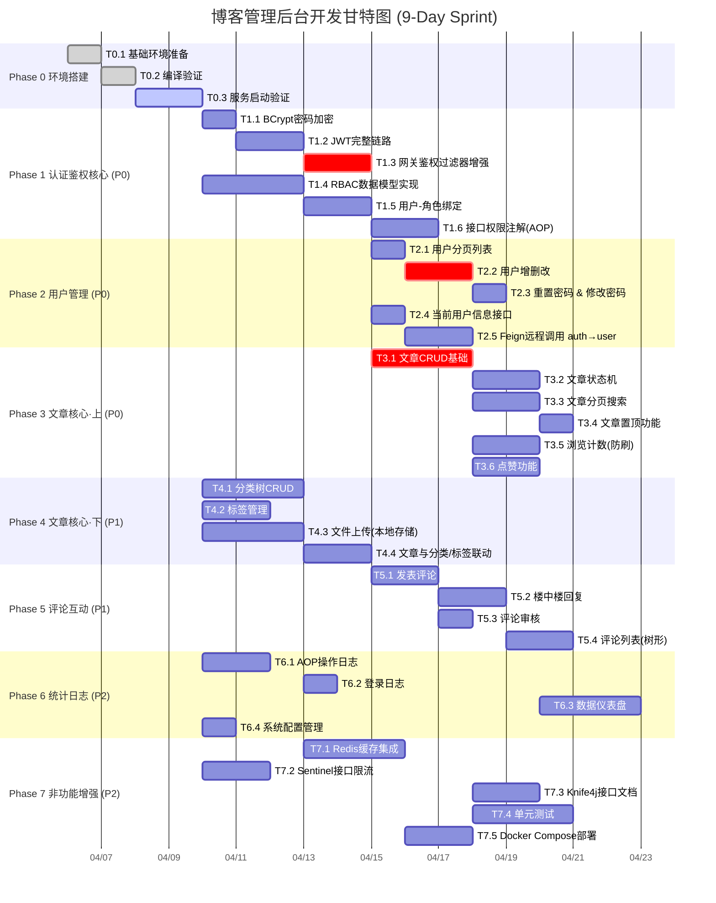

# 博客管理后台 - 开发甘特图

> **总工期**: 9个工作日 | **总任务数**: 37个 | **技术栈**: DDD + Spring Cloud

---

## 关键里程碑 (Milestones)

| 里程碑 | 时间点 | 完成标准 | 对应任务 |
|--------|--------|----------|----------|
| **M1: 项目跑通** | Day 1 结束 | 全部服务启动成功 + 能登录返回Token | T0.1~T0.3, T1.1~T1.2 |
| **M2: 鉴权闭环** | Day 3 结束 | JWT→网关鉴权→RBAC权限控制全链路打通 | T1.3~T1.6 |
| **M3: 核心可用** | Day 5 结束 | 用户+文章两大核心模块CRUD+状态机完成 | T2.x, T3.1~T3.4 |
| **M4: 功能完整** | Day 7 结束 | 分类/标签/上传/评论全部接口就绪 | T4.x, T5.x |
| **M5: 项目交付** | Day 9 结束 | 缓存+限流+文档+测试+Docker全部完成 | T6.x, T7.x |

---

## 优先级说明

| 标记 | 含义 | 处理策略 |
|------|------|----------|
| **P0-阻塞** | 不做后面的全卡住 | 第一时间完成 |
| **P0** | 核心功能，MVP必须 | 高优先级排期 |
| **P1** | 重要功能，体验必需 | P0完成后跟进 |
| **P2** | 锦上添花，可后续迭代 | 有时间再做 |
| **crit** | 关键路径任务 | 延迟会影响整体进度 |
